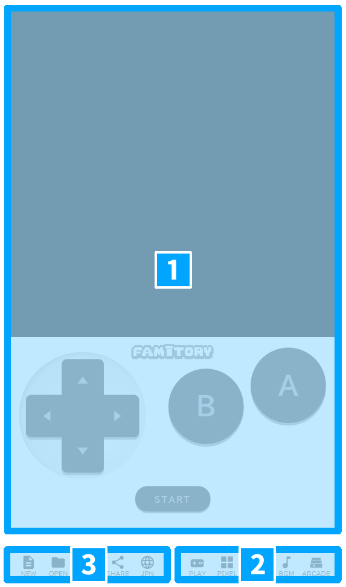

# ＜第1章＞ 画面とボタンの見方

まずは「どこに何があるか」を覚えよう。
くわしい操作のやり方は、次の章から順番に説明していくよ。

---

## 画面ぜんたい

FAMITORYの画面は、おおきく3つのエリアに分かれているよ。

  
  

    
<strong>①真ん中の広いところ</strong> 絵をかいたり、ステージを作ったり、できたゲームをあそぶ場所。作業もプレイもここで行うよ。

    
<strong>②左下のバー</strong> ゲームデータの出し入れをするボタン（新しく作る・ひらく・保存・シェア）と、言語の切り替え。

    
<strong>③右下のバー</strong> ボタンを押すと、真ん中の画面がガラッと切り替わるよ。「今から何をするか」を選ぶバー（遊ぶ・絵・ステージ・音・ARCADE）。

  

---

## 左下のバー（ゲーム全体の操作）

| ボタン | なにをする？ |
|---|---|
| **NEW** <small>（新規）</small> | 新しいゲームを作りはじめる |
| **OPEN** <small>（読み込み）</small> | 前に保存したゲームをひらく |
| **SAVE** <small>（保存）</small> | いま作っているゲームを保存する |
| **SHARE** <small>（共有）</small> | ゲームをURLにして人に送る／ARCADEにのせる |
| **JPN / ENG** | 日本語⇔英語の切り替え |

> **ワンポイント**
> 作ったゲームは、SAVEを押さないと消えてしまうことがあるよ。
> 作業の区切りごとにSAVEするのがおすすめ！

---

## 右下のバー（作るモードの切り替え）

ここで「今から何をするか」を切り替えるよ。
押すと、真ん中の作業スペースの中身がガラッと変わる。

| ボタン | なにをする場所？ |
|---|---|
| **PLAY** <small>（プレイ）</small> | 作ったゲームを **実際に遊ぶ** 場所。 キーボードやスマホの画面ボタンで操作するよ。 |
| **PIXEL** <small>（ピクセル）</small> | キャラや背景の **絵をかく** 場所。 左にツール（ペン・消しゴムなど）、下に色えらびがあるよ。 |
| **STAGE** <small>（ステージ）</small> | ステージに **ブロックや敵をならべる** 場所。 右側の「使えるパーツ一覧」から選んで配置するよ。 |
| **BGM** <small>（サウンド）</small> | **音楽と効果音** を作る場所。 音符をマス目に置くイメージで曲が作れるよ。 |
| **ARCADE** | みんなが公開したゲームを **見る・遊ぶ** 場所。 |

今どのモードを使っているかは、ボタンの色でわかるよ。
（光っているボタンが「いま使っているモード」）

---

## ゲーム設定（タイトル・名前）

PLAY画面の近くに、**ゲームのタイトル** や **作った人の名前** を入れる場所があるよ。
最初に設定しておくと、シェアするときに便利！

> *スクリーンショット準備中*

---

<h2 class="no-num">まとめ</h2>

- ボタンは画面下のバーに全部ある
- **左下** ＝ ファイル操作、**右下** ＝ モード切り替え
- 作業する前に、まず右下のバーで「どのモードで作るか」を決めよう

次の章から、実際に **PIXEL（絵）** を触ってみよう！
