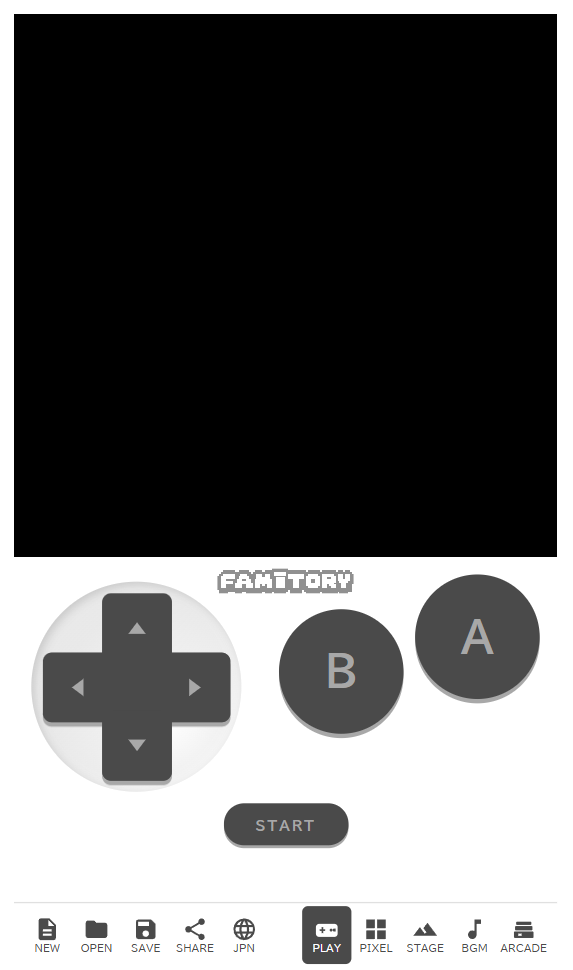
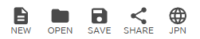
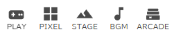

# &lt;Chapter 1&gt; Screen & Buttons

First, let's learn "what is where."
Detailed instructions come in later chapters.

---

## The big area in the middle

Where you draw, build stages, and play the game you made. All of your work and play happens here.

---

## Bottom-left bar (whole-game operations)

Buttons for handling game data (new / open / save / share) and the language toggle.

| Button | What it does |
|---|---|
| **NEW** | Start making a new game |
| **OPEN** | Open a game you saved before |
| **SAVE** | Save the game you're working on |
| **SHARE** | Turn the game into a URL, or publish to ARCADE |
| **JPN / ENG** | Switch between Japanese and English |

> **Tip**
> If you don't press SAVE, the game you made may be lost.
> Pressing SAVE at good break points is a safe habit!

---

## Bottom-right bar (switch creation mode)

Pressing these buttons swaps the main area completely. They decide "what you're doing right now" (play / draw / stage / sound / arcade).

| Button | What is this place for? |
|---|---|
| **PLAY** | The place to **actually play** the game you made. Use the keyboard, or the on-screen buttons on a phone. |
| **PIXEL** | The place to **draw pictures** of characters and backgrounds. Tools (pen, eraser, etc.) are on the left; colors are at the bottom. |
| **STAGE** | The place to **place blocks and enemies** on a stage. Pick parts from the "available parts" list on the right. |
| **BGM** | The place to make **music and sound effects**. Place notes on a grid to compose a song. |
| **ARCADE** | The place to **see and play** games other people have published. |

The glowing button shows which mode you're currently in.

---

## Game settings (title & author)

Near the PLAY screen there are fields for the **game title** and **author name**.
Setting them early makes sharing easier!

> *Screenshot coming soon*

---

## Summary

- All the buttons live on the bars at the bottom
- **Bottom-left** = file operations, **bottom-right** = mode switch
- Before you start working, pick a mode from the bottom-right bar first

In the next chapter, let's actually try **PIXEL (drawing)**!
